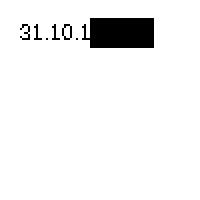
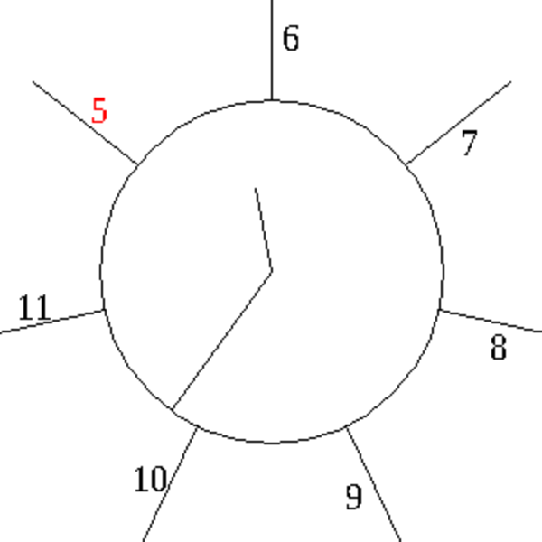
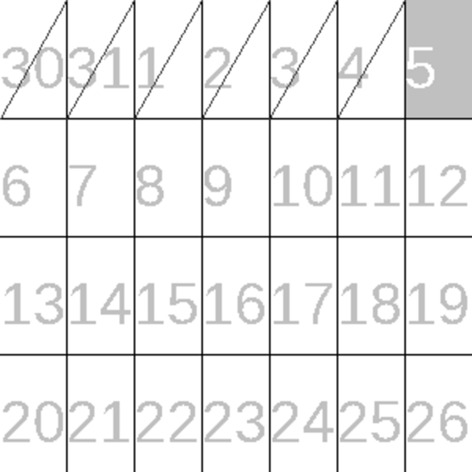
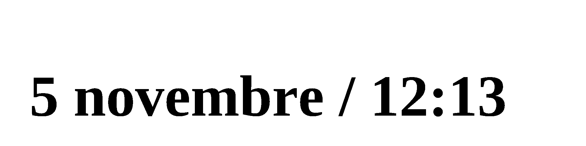
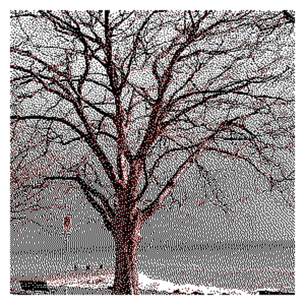
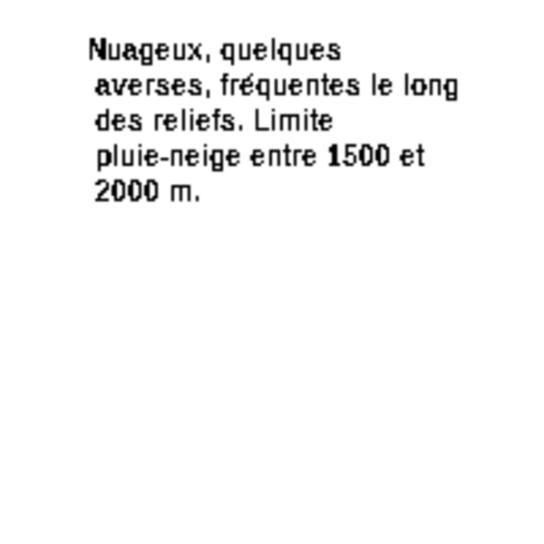
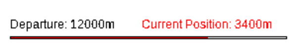
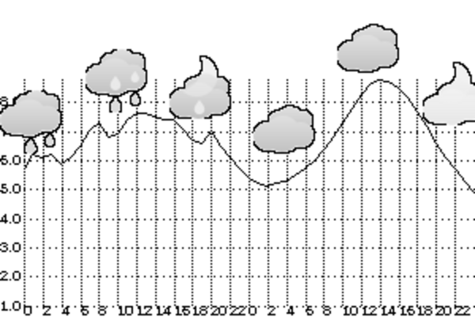

# Available Widgets

## `AccountBalance <url>`

Displays the raw text returned by an HTTP GET request. (Named because I use this to show my kids pocket money which is behind such a raw-text API)

Example: `10 10 190 50 AccountBalance https://api.ipify.org` will show your API address:



## `BigClock`
Shows an analog clock surrounded by a one-week calendar. You can use *clock faces* (covered below) to add time- or day-bound information.

Example: `0 0 300 300 BigClock` without any faces shows this:



The numbers are days of the month, with the current day in red. After twelve o'clock (6 in the sample) is Monday.

## `Calendar <row count>`
Shows a calendar in a grid, one week per row. The parameter says how many extra rows to add. 0 means one row, 3 means four rows, and so on.
The first column is Monday. Past days are slashed through. You can use *calendar faces* to have information added to the calendar.

Example: `0 0 300 300 Calendar 3`



## `DateTime`
Shows the current date and time in text. The font is currently not configurable.
It uses the system's default locale, in my case French.

Example: `100 0 2000 400 DateTime`



## `Image <path on device>`
Renders an image. The path may be absolute, or relative to the working directory
when executing the app (not relative to the layout file).

Example: `10 10 290 290 Image docs/examples/lake-tree.jpeg` The preview below shows how it looks like
on a three-colour (black/red/white) WaveShare display:



## `Motd`
"Message Of The Day". Renders text from various *motd faces* (see below).

For instance this layout will render a summary of the weather in Switzerland:

```
300x300
# this is a motd-face, doesn't render anything by itself but contributes data to the Motd widget
MeteoSuisse 100025
10 10 290 290 Motd
```



## `Progress`
Shows a progress bar whose value is read from a local file. I use this to tell my family how far I'm from home when returning from work.
The progress bar is only rendered when file `/tmp/distance` exists and contains exactly one line `x/y` where `x`
is the current value and `y` is the maximum value.

Assuming `/tmp/distance` contains `3400/12000`, then `10 10 290 40 Progress m Departure "Current Position"` renders this:



## `Weather <hour range>`
Shows a diagram of the current weather.
Note that the weather will also be shown in the "big clock" widget if your layout contain one.

This layout will show the weather forecast for the next 48 hours in Lausanne, Switzerland. The vertical axis is degrees Celsius:

```
600x300
MeteoSuisse 100025
0 0 300 200 Weather 48
```



# Faces

*(to be continued)*